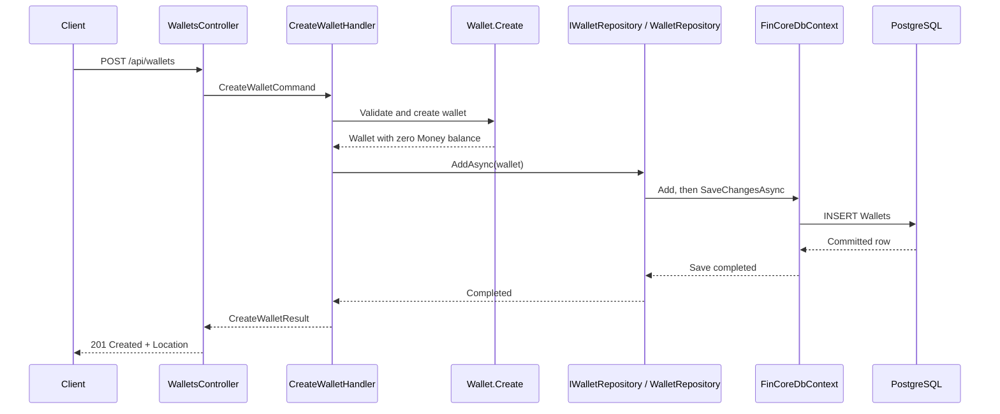

# PostgreSQL persistence: a guided FinCore lesson

FinCore now stores wallets in PostgreSQL through EF Core. POST creates a row; GET reads it through the same Application abstraction. This lesson stops at wallet creation and lookup. No extra messaging, caching, frontend, containers, or mediator framework is introduced.

## 1. EF Core, ORM, PostgreSQL, and the provider

### ORM (object-relational mapper)

1. **Simple meaning:** A translator between C# objects and database rows.
2. **Real example:** Turn a `Wallet` into an INSERT statement, then turn a SELECT result back into a `Wallet`.
3. **Problem solved:** Repeated SQL, parameter handling, and manual property copying for ordinary persistence.
4. **FinCore use:** The repository works with wallets while the mapper produces SQL.
5. **Technical definition:** Software maps an object model to a relational schema of tables, columns, and keys.
6. **Common mistakes:** Assuming it removes the need to understand SQL, database constraints, or query performance.
7. **Trade-offs:** Less repetitive code, but generated SQL and tracking have costs. We still own business rules, schema design, precision, access control, concurrency, transaction boundaries, indexes, migrations, backups, and recovery.

### Entity Framework Core (EF Core)

1. **Simple meaning:** Microsoft's .NET library for doing this translation.
2. **Real example:** `context.Wallets.Add(wallet)` followed by `SaveChangesAsync()` writes the wallet.
3. **Problem solved:** Implementing a mapper and change tracking ourselves.
4. **FinCore use:** EF Core remains in Infrastructure, configured with fluent C# mapping rather than Domain attributes.
5. **Technical definition:** A .NET ORM with query translation, change tracking, relational mapping, and migration tooling.
6. **Common mistakes:** Calling `Add` without saving, or leaking EF types into Application contracts.
7. **Trade-offs:** Productive for this model; unusual reporting or bulk workloads may need carefully written SQL later.

### PostgreSQL

1. **Simple meaning:** The server that durably stores our data.
2. **Real example:** A wallet survives an API restart because its row is on the database server.
3. **Problem solved:** An in-memory list disappears when the process exits and cannot enforce shared, durable constraints.
4. **FinCore use:** Stores wallet rows, exact decimal amounts, UTC creation instants, and integrity rules.
5. **Technical definition:** An open-source relational database management system supporting SQL, transactions, and constraints.
6. **Common mistakes:** Treating installing the server as equivalent to creating the application schema, or using a production database for tests.
7. **Trade-offs:** Strong relational integrity fits financial data, but operating a server requires configuration, backups, and monitoring. PostgreSQL alone does not make a wallet system production-ready.

### Provider and packages

1. **Simple meaning:** A provider is the adapter that lets EF Core speak a particular database's language.
2. **Real example:** `UseNpgsql(connectionString)` selects PostgreSQL SQL generation and connectivity.
3. **Problem solved:** EF Core cannot treat every database's SQL and data types as identical.
4. **FinCore use:** Infrastructure references `Npgsql.EntityFrameworkCore.PostgreSQL` **10.0.3**, `Microsoft.EntityFrameworkCore.Relational` **10.0.12**, and private `Microsoft.EntityFrameworkCore.Design` **10.0.12**. The local `dotnet-ef` tool is **10.0.12**. Domain and Application have no EF packages.
5. **Technical definition:** A database-specific EF implementation; Npgsql also supplies the underlying PostgreSQL driver.
6. **Common mistakes:** Mixing EF major versions or allowing a private design-time dependency to select a newer runtime only in Infrastructure. The explicit Relational reference keeps downstream runtime versions aligned.
7. **Trade-offs:** PostgreSQL features become accessible, but switching providers later requires mapping and migration review. EF 10 and Npgsql's EF 10 provider support this .NET 10 project. See [Npgsql's EF 10 release notes](https://www.npgsql.org/efcore/release-notes/10.0.html).

## 2. DbContext, DbSet, and tracking

### DbContext

1. **Simple meaning:** A short-lived workspace for reading and saving database objects.
2. **Real example:** A POST request gets a context, adds one wallet, saves, and disposes the context.
3. **Problem solved:** Coordinating mapping, queries, and pending changes for an operation.
4. **FinCore use:** `FinCoreDbContext` exposes wallets and discovers `WalletConfiguration` from Infrastructure.
5. **Technical definition:** An EF session and unit of work over tracked entities. It is not the database itself, nor necessarily an always-open connection.
6. **Common mistakes:** Sharing one context across requests or running concurrent operations on it; DbContext is not thread-safe.
7. **Trade-offs:** A short scope limits stale data and memory use. Larger operations may need deliberate boundaries. See [context lifetime guidance](https://learn.microsoft.com/en-us/ef/core/dbcontext-configuration/).

### DbSet<T>

1. **Simple meaning:** The context's entry point for a kind of stored object.
2. **Real example:** `DbSet<Wallet> Wallets` lets us add a wallet or filter wallets by ID.
3. **Problem solved:** Providing typed access instead of manually naming tables everywhere.
4. **FinCore use:** `WalletRepository` accesses `context.Wallets`.
5. **Technical definition:** A typed EF entity set supporting database queries and entity state changes. It is not an eagerly loaded list of every row.
6. **Common mistakes:** Assuming accessing the property loads the entire table, or that `Add` sends an INSERT immediately.
7. **Trade-offs:** Convenient and typed, but queries must still be designed to fetch only needed rows.

### Tracking and AsNoTracking()

1. **Simple meaning:** Tracking means remembering loaded objects and their changes. No-tracking means reading without keeping that change record.
2. **Real example:** A tracked wallet whose `Balance` is replaced can be saved; a GET response only needs a snapshot of values.
3. **Problem solved:** Tracking automates updates; no-tracking avoids unnecessary bookkeeping for reads.
4. **FinCore use:** Added wallets are tracked until saved. `GetByIdAsync` uses `AsNoTracking()` because its contract is a read. Integration tests verify no tracked entries remain after GET-style reads.
5. **Technical definition:** EF records entity state and detects changes on save; no-tracking query results are not attached to that context's change tracker.
6. **Common mistakes:** Modifying a no-tracking result and expecting a later save to persist it automatically.
7. **Trade-offs:** Tracking supports updates and identity reuse; no-tracking usually reduces read overhead. A future update use case needs an explicit tracked-load strategy. See [tracking queries](https://learn.microsoft.com/en-us/ef/core/querying/tracking).

## 3. Mapping Money and protecting rows

### Value object and owned type (chosen)

1. **Simple meaning:** Money is an amount plus currency, meaningful by its values. An owned mapping stores it as part of its wallet.
2. **Real example:** `Money(1234.5678m, "BDT")` becomes `Balance=1234.5678` and `BalanceCurrency=BDT` in one wallet row.
3. **Problem solved:** Preserving both parts of immutable Money while keeping EF details out of Domain.
4. **FinCore use:** `OwnsOne(wallet => wallet.Balance)` explicitly maps both getter-only properties. EF binds Money's existing constructor. The wallet navigation is required.
5. **Technical definition:** An owned entity type belongs to its owner; EF uses an internal ownership key. Here owner and owned value share one table; Money gains no public domain ID.
6. **Common mistakes:** Mapping only Amount and losing Currency, assuming getter-only properties are discovered automatically, or sharing the same owned instance between different owners.
7. **Trade-offs:** This supports the current immutable constructor with no persistence changes to the entity. It duplicates currency and has EF ownership semantics; a check constraint prevents currency drift. See [owned types](https://learn.microsoft.com/en-us/ef/core/modeling/owned-entities).

### Complex type (alternative)

1. **Simple meaning:** A bundle of properties treated as a value without an entity identity.
2. **Real example:** A complex balance can contribute amount and currency columns to the wallet table.
3. **Problem solved:** Modeling value objects without owned-entity identity semantics.
4. **FinCore use:** Considered, but not used in this first mapping; owned mapping already supports the current constructor-only Money without adding setters.
5. **Technical definition:** EF complex properties are structured values in an entity model. EF 10 supports complex types; constructor/materialization compatibility must be checked for the exact immutable shape.
6. **Common mistakes:** Assuming every C# immutable constructor shape works identically across complex and owned mappings.
7. **Trade-offs:** Often a better conceptual match for values; do not reshape Domain solely to adopt it here. See [EF 10 complex-type improvements](https://learn.microsoft.com/en-us/ef/core/what-is-new/ef-core-10.0/whatsnew).

### Flattening into columns (alternative)

1. **Simple meaning:** Store a nested object's pieces in ordinary columns.
2. **Real example:** Store balance amount alongside currency instead of a separate Money table.
3. **Problem solved:** Relational tables do not directly store arbitrary C# object graphs.
4. **FinCore use:** The selected owned mapping physically flattens Money into the wallet row. A separate persistence model could instead reconstruct Money from scalar columns manually.
5. **Technical definition:** Structural decomposition of a value into columns; it describes storage layout, not necessarily a separate EF feature.
6. **Common mistakes:** Thinking flattening requires exposing public setters or removing the value object from Domain.
7. **Trade-offs:** Easy SQL and constraints; manual persistence models add mapping code and can drift from Domain.

### Value converter (alternative for Money; used for Status)

1. **Simple meaning:** Translate one property into one stored representation and back.
2. **Real example:** `WalletStatus.Active` becomes the text `Active`.
3. **Problem solved:** A C# property may have a different convenient storage representation.
4. **FinCore use:** Status uses `HasConversion<string>()`. Money does not use a converter: it contains two independently constrained values.
5. **Technical definition:** EF conversion expressions map a model property to and from a provider value, ordinarily in one column.
6. **Common mistakes:** Expecting an amount-only Money converter to obtain Currency from a neighboring column, or assuming serialized Money has the same query behavior as scalar columns.
7. **Trade-offs:** Excellent for scalar wrappers and enums. Packing Money into one serialized value complicates constraints and queries; enum renames require data migration. See [value conversions](https://learn.microsoft.com/en-us/ef/core/modeling/value-conversions).

### Constraints, precision, and scale

1. **Simple meaning:** Database rules reject invalid rows; precision and scale define an exact decimal's capacity.
2. **Real example:** `numeric(19,4)` allows 19 total digits, of which 4 are after the decimal point: at most 15 whole digits.
3. **Problem solved:** Protecting persisted data even when writes come from scripts or other applications.
4. **FinCore use:** The generated schema below is checked by PostgreSQL, independent of Domain code.
5. **Technical definition:** A primary key enforces unique non-null identity; NOT NULL requires a value; CHECK requires its expression not to be false; constrained numeric limits range and stored scale.
6. **Common mistakes:** NOT NULL does not reject an empty UUID. A CHECK alone does not reject NULL. PostgreSQL can round excess fractional digits before checking a numeric column; Domain rejects such amounts first.
7. **Trade-offs:** More integrity, but schema changes require migrations. Four decimal places is an explicit current FinCore policy, not a claim that every currency uses four fractional digits. Currency checks validate shape, not membership in an ISO registry. See [PostgreSQL numeric types](https://www.postgresql.org/docs/current/datatype-numeric.html).

| Column | PostgreSQL type | Rules |
| --- | --- | --- |
| Id | uuid | Primary key, supplied by Domain |
| OwnerId | uuid | NOT NULL, not empty UUID |
| Currency | varchar(3) | NOT NULL, exactly three uppercase ASCII letters |
| Balance | numeric(19,4) | NOT NULL, nonnegative |
| BalanceCurrency | varchar(3) | NOT NULL, equal to Currency |
| Status | varchar(16) | NOT NULL, Active / Inactive / Suspended |
| CreatedAt | timestamp with time zone | NOT NULL, supplied as UTC by Domain |

There is no owner foreign key because this project has no Owner table yet. Multiple wallets per owner are not prohibited. No extra index is needed for the current ID lookup: the primary key already provides one. PostgreSQL stores a creation instant rather than the original time-zone label; its timestamp precision is microseconds, versus .NET's 100-nanosecond ticks.

### Domain validation and defense in depth

1. **Simple meaning:** Protect the same important rule at more than one boundary.
2. **Real example:** Money rejects a negative amount early; PostgreSQL rejects a negative balance from direct SQL too.
3. **Problem solved:** Application code can be bypassed, while database errors alone make a poor business API.
4. **FinCore use:** Domain validates owner, currency, amount, and wallet operations; database rules protect stored rows. Domain exceptions on create become HTTP 400 responses.
5. **Technical definition:** Layered controls reduce reliance on any single validation path.
6. **Common mistakes:** Deleting Domain rules because CHECK constraints exist, or assuming database checks enforce every business workflow.
7. **Trade-offs:** Some duplicated rules must stay aligned. Integration tests exercise SQL writes that deliberately bypass Domain. Domain enforces supported amount scale before PostgreSQL can round it; arbitrary SQL writers still need a rounding policy.

## 4. Repository and save boundary

### Repository pattern

1. **Simple meaning:** An application-facing place to store and retrieve wallets.
2. **Real example:** The handler calls `IWalletRepository.AddAsync(wallet)` without knowing SQL.
3. **Problem solved:** Depending directly on PostgreSQL from a use case would couple Application to Infrastructure.
4. **FinCore use:** The existing interface stays in Application; `WalletRepository` in Infrastructure implements it with a context. Add commits; Get returns a detached wallet or null.
5. **Technical definition:** A persistence abstraction around domain objects; the outer implementation depends on the inner contract, following dependency inversion.
6. **Common mistakes:** Moving the interface outward because its implementation uses EF, exposing `IQueryable` from it, or assuming Add only stages changes.
7. **Trade-offs:** Another small layer over EF; it fits the architecture already present. Do not build a generic repository framework or wrap every EF method. In a simpler application that deliberately uses EF directly, this abstraction may add little value.

### SaveChanges and transaction

1. **Simple meaning:** Saving sends pending changes; a transaction makes a group of writes succeed or fail together.
2. **Real example:** Adding a wallet marks it Added; `SaveChangesAsync` performs its INSERT before POST returns 201.
3. **Problem solved:** An object in memory is not yet a durable row; partial multi-statement writes can corrupt workflows.
4. **FinCore use:** `WalletRepository.AddAsync` saves immediately. A failure propagates and no success response is returned. EF's save operation uses a transaction when needed by the provider.
5. **Technical definition:** Saving detects tracked changes and issues database commands. A transaction is an atomic database operation boundary; a context's entire lifetime is not automatically one transaction.
6. **Common mistakes:** Thinking Add writes immediately, or that separate SaveChanges calls automatically form one atomic business operation.
7. **Trade-offs:** Immediate save is simplest for one wallet creation, but it saves all pending changes on the shared context. Future transfers across wallets need an explicitly designed shared save/transaction boundary.

The alternatives are deliberate:

| Approach | Advantage | Cost / when to avoid |
| --- | --- | --- |
| Repository saves (chosen) | Existing handler stays simple; Add means committed | Cannot compose several repository calls into one save by default |
| Handler calls a small persistence abstraction | Handler owns when to commit; EF stays outside Application | Extra contract and coordination for this one-write use case |
| Explicit IUnitOfWork | Coordinates several repositories and one save boundary | Duplicates DbContext capabilities; unnecessary until multi-write use cases need it |

### Unit of Work pattern (explained, no new abstraction added)

1. **Simple meaning:** Collect related changes and commit them together.
2. **Real example:** A future transfer would debit one wallet and credit another in one operation.
3. **Problem solved:** Saving the debit while losing the credit would be unacceptable.
4. **FinCore use:** DbContext already supplies this behavior for one save; we do not add `IUnitOfWork` today.
5. **Technical definition:** A pattern tracking work within a business operation and coordinating persistence.
6. **Common mistakes:** Adding the interface automatically because a repository exists, or promising concurrency protection merely by adding it.
7. **Trade-offs:** Useful for coordinated multi-repository writes, but adds ceremony to single-write CRUD. If later introduced, handlers would stage changes and call one shared commit abstraction. Atomicity and competing updates still require separate design.

## 5. Dependency injection and configuration

### Dependency injection (DI)

1. **Simple meaning:** Give an object its collaborators rather than having it construct them.
2. **Real example:** The container supplies `WalletRepository` when a handler asks for `IWalletRepository`.
3. **Problem solved:** Hardcoded construction would make replacement and lifetime management difficult.
4. **FinCore use:** `AddInfrastructure` registers `AddDbContext(...UseNpgsql(...))` and `AddScoped<IWalletRepository, WalletRepository>()`; Program registers both handlers and controllers.
5. **Technical definition:** Constructor dependencies are resolved by a configured service container, applying inversion of control.
6. **Common mistakes:** Keeping the old singleton repository registration or resolving a scoped context from a singleton.
7. **Trade-offs:** Centralized composition helps this layered application, but missing registrations cause startup/runtime errors. Manual construction can be clearer for tiny programs or isolated unit tests.

### Singleton, Scoped, and Transient lifetimes

1. **Simple meaning:** Singleton means one per application; Scoped means one per scope; Transient means new for every resolution.
2. **Real example:** Two handlers in the same HTTP request can share one scoped context; different requests receive different contexts.
3. **Problem solved:** Objects with mutable state need a suitable sharing and disposal boundary.
4. **FinCore use:** Context, repository, and handlers are scoped. ASP.NET Core normally provides one scope per request.
5. **Technical definition:** DI lifetime determines instance reuse and ownership. AddDbContext defaults to scoped; the container disposes it at scope end.
6. **Common mistakes:** Singleton contexts share unsafe mutable tracking state; transient contexts can split one operation across unrelated sessions. A transient handler can use a scoped context, but is not needed here.
7. **Trade-offs:** Scoped suits these requests. Singleton is suitable for thread-safe shared services; transient for lightweight independent objects. Background work would need its own explicit scope.

### Connection string, environment configuration, and secrets

1. **Simple meaning:** Connection settings tell the app which database to reach and how to sign in; each environment can supply different settings.
2. **Real example:** `Host=localhost;Port=5432;Database=fincore;Username=postgres` is the committed development baseline, without a password.
3. **Problem solved:** The same application must work with different servers without editing C# code.
4. **FinCore use:** Program reads `ConnectionStrings:FinCore`. `appsettings.Development.json` can override base settings; `ConnectionStrings__FinCore` in the process environment can override them again. The migration factory reads ConnectionStrings:FinCore directly from FinCore.Api/appsettings.json and does not use environment variables.
5. **Technical definition:** A connection string is a driver-parsed set of connection parameters. ASP.NET Core combines configuration providers with override precedence; deployment secrets are externally supplied sensitive values.
6. **Common mistakes:** Committing production passwords, echoing connection strings to logs, assuming a newly set user variable appears in an already-running terminal, or assuming the design-time factory uses runtime environment overrides.
7. **Trade-offs:** Environment settings keep secrets out of Git but still require secure handling. A dedicated local role is preferable to the baseline postgres administrator; production should use restricted credentials and a managed secret source. No secret-management platform is introduced here.

## 6. Migrations and tests

### Migration, model snapshot, and design-time factory

1. **Simple meaning:** A migration is a versioned database change. A snapshot remembers the last model. The factory gives EF tooling a context without starting the API.
2. **Real example:** `InitialWalletPersistence` creates Wallets and its constraints.
3. **Problem solved:** Developers and deployments need repeatable schema evolution rather than manually creating tables differently everywhere.
4. **FinCore use:** Migration files live under Infrastructure/Persistence/Migrations. The factory allows Infrastructure to be both migration and startup project, keeping the Design package out of API.
5. **Technical definition:** `migrations add` compares the current model to the snapshot and generates Up/Down operations, metadata, and a new snapshot. It does not update the database. `database update` applies missing operations and records them in `__EFMigrationsHistory`; it can create a missing database when the role has permission.
6. **Common mistakes:** Using EnsureCreated with migrations, editing an already-deployed migration, or treating generated SQL as automatically safe. Review locks, table rewrites, destructive changes, and data conversions before production deployment.
7. **Trade-offs:** Reviewable history costs maintenance. Down may destroy data; it is not a backup. See [EF migrations](https://learn.microsoft.com/en-us/ef/core/managing-schemas/migrations/).

The design-time factory is a small object-creation hook required by our tooling setup, not a new application factory framework. It solves the problem of constructing a context outside DI, at the cost of separately documenting tooling configuration. Do not use it in request handlers.

### Unit test and integration test

1. **Simple meaning:** A unit test checks a small piece in isolation; an integration test checks cooperating real components.
2. **Real example:** Money rejects an invalid currency without a database; repository tests save and reload Money through PostgreSQL.
3. **Problem solved:** Domain tests cannot reveal SQL translation errors, missing constraints, timestamp differences, or broken materialization.
4. **FinCore use:** Existing Domain tests remain, with currency/precision boundary tests added. Repository tests use real PostgreSQL, apply migrations to a generated `fincore_test_<guid>` database, and remove only that database afterward.
5. **Technical definition:** Unit tests isolate logic; integration tests exercise boundaries such as EF mapping, driver, and database server together.
6. **Common mistakes:** Mocking DbContext and claiming persistence was verified; reading back only from the same tracker; substituting an in-memory provider for PostgreSQL constraint tests.
7. **Trade-offs:** Integration tests require a server and a role allowed to create databases. Set `FinCore_TestConnectionString` to enable them; otherwise they visibly skip. No Testcontainers or Docker is used. CI should explicitly supply the test connection so skipped tests cannot be mistaken for database validation.

## 7. Command, query, and complete request flow

### Command and query

1. **Simple meaning:** A command asks to change something; a query asks to read something.
2. **Real example:** CreateWalletCommand creates a wallet; GetWalletQuery asks for a wallet by ID.
3. **Problem solved:** Separating intent makes it clear which use cases can change stored state.
4. **FinCore use:** Controllers call concrete handlers directly. Create returns CreateWalletResult; Get returns GetWalletResult or null, translated to HTTP 404.
5. **Technical definition:** A command represents requested state mutation; a query represents a read operation. Result records are DTOs: plain data containers sent across layer boundaries.
6. **Common mistakes:** Adding a mediator or separate read database merely to use these names, or returning tracked EF entities directly from controllers.
7. **Trade-offs:** Small extra types clarify responsibilities. This is simple command/query separation, not a full CQRS infrastructure. For a tiny script, separate handler types might add little value.



GET follows `HTTP -> WalletsController -> GetWalletHandler -> IWalletRepository -> WalletRepository -> FinCoreDbContext -> PostgreSQL`. EF executes a parameterized ID query without tracking, reconstructs Wallet and Money, and the handler creates the result record. Existing rows return 200; absent IDs return 404. Malformed GUID routes do not match. Creation validation failures return 400. An infrastructure failure does not produce a false 201.

## 8. Run it from the repository root (PowerShell)

Package/tool setup used during implementation, now pinned in the project and tool manifest:

```powershell
dotnet add backend/src/FinCore.Infrastructure package Npgsql.EntityFrameworkCore.PostgreSQL --version 10.0.3
dotnet add backend/src/FinCore.Infrastructure package Microsoft.EntityFrameworkCore.Relational --version 10.0.12
dotnet add backend/src/FinCore.Infrastructure package Microsoft.EntityFrameworkCore.Design --version 10.0.12
# The manifest already exists; normally only restore it:
dotnet tool restore
dotnet restore backend/FinCore.sln
```

Set ConnectionStrings:FinCore in backend/src/FinCore.Api/appsettings.json to your local PostgreSQL connection string, including its password when required. The migration factory reads this file directly. Keep real credentials out of commits.

The initial migration was generated with the following command. **Do not add it again**; it is already checked into the working tree:

```powershell
dotnet ef migrations add InitialWalletPersistence --project backend/src/FinCore.Infrastructure --startup-project backend/src/FinCore.Infrastructure --output-dir Persistence/Migrations
```

Build, review SQL, apply migrations, and test:

```powershell
dotnet build backend/FinCore.sln
dotnet ef migrations script --project backend/src/FinCore.Infrastructure --startup-project backend/src/FinCore.Infrastructure
dotnet ef database update --project backend/src/FinCore.Infrastructure --startup-project backend/src/FinCore.Infrastructure
# Use a LOCAL TEST server and a role with CREATEDB. Tests create their own unique database.
$env:FinCore_TestConnectionString = $env:ConnectionStrings__FinCore
dotnet test backend/FinCore.sln
dotnet run --project backend/src/FinCore.Api --no-launch-profile --urls http://localhost:5196
```

In another terminal, create a wallet and follow its Location URL:

```powershell
$body = @{ ownerId = [guid]::NewGuid().ToString(); currency = 'BDT' } | ConvertTo-Json
$created = Invoke-WebRequest http://localhost:5196/api/wallets -Method Post -ContentType application/json -Body $body -UseBasicParsing
$created.StatusCode # 201
$wallet = $created.Content | ConvertFrom-Json
Invoke-RestMethod $created.Headers.Location # wallet data
Invoke-WebRequest ('http://localhost:5196/api/wallets/' + [guid]::NewGuid()) -UseBasicParsing # 404
```

Using PostgreSQL's psql (adjust path, role, database, and port for your server; `-W` prompts for a password):

```powershell
& 'C:\Program Files\PostgreSQL\18\bin\psql.exe' -h localhost -p 5432 -U postgres -d fincore -W
```

Then run:

```sql
\d "Wallets"
SELECT "Id", "OwnerId", "Currency", "Balance", "BalanceCurrency", "Status", "CreatedAt" FROM "Wallets";
SELECT * FROM "__EFMigrationsHistory";
```

Compare the row ID to POST's `walletId`. Restart the API and GET that same ID to demonstrate durability. API startup deliberately does not apply migrations: schema changes remain an explicit, reviewable action.

## 9. File map

New files:

- `dotnet-tools.json`: pinned repository-local EF CLI.
- `backend/src/FinCore.Infrastructure/Persistence/Context/FinCoreDbContext.cs`: EF session.
- `backend/src/FinCore.Infrastructure/Persistence/Context/FinCoreDbContextFactory.cs`: tooling construction.
- `backend/src/FinCore.Infrastructure/Persistence/Configurations/WalletConfiguration.cs`: table, columns, owned Money, constraints.
- `backend/src/FinCore.Infrastructure/Persistence/Repositories/WalletRepository.cs`: committed add and no-tracking read.
- `backend/src/FinCore.Infrastructure/Persistence/Migrations/*InitialWalletPersistence.cs`, its Designer, and `FinCoreDbContextModelSnapshot.cs`: generated schema history.
- `backend/src/FinCore.Application/Features/Wallets/GetWalletQuery.cs`, `GetWalletHandler.cs`, `GetWalletResult.cs`: read use case.
- `backend/tests/FinCore.IntegrationTests/PostgresFixture.cs`, `WalletRepositoryTests.cs`: actual PostgreSQL tests.
- `backend/tests/FinCore.Domain.Tests/Entities/MoneyPrecisionTests.cs`: domain boundary checks.
- `docs/postgresql-persistence.md`: this lesson.

Updated files: Infrastructure project and DI registration; Application repository interface; Domain Money validation; API Program, controller, configuration, and HTTP examples; README and architecture notes. The old InMemoryWalletRepository is removed. CreateWalletHandler retains its existing Domain-first flow and now resolves the real repository.

## 10. Validation completed

Validated on 2026-09-19 with .NET SDK 10.0.301 and PostgreSQL 18.1:

- Solution build: **0 warnings, 0 errors**.
- Domain tests: **18 passed** (12 existing plus 6 currency/amount boundary cases).
- Real PostgreSQL integration tests: **17 passed, 0 skipped**.
- The existing Application test project contains no tests; it is not included in those passing counts.
- Initial migration applied; psql confirmed all seven columns, the primary key, five CHECK constraints, and NOT NULL requirements.
- `__EFMigrationsHistory` contains `20260919000312_InitialWalletPersistence` with EF version 10.0.12.
- POST returned **201** and a Location URL for wallet `590476fb-a8db-407e-a7bb-24375bae79cf`.
- Direct SQL confirmed BDT, balance 0.0000, matching BalanceCurrency, and Active status.
- GET returned **200**, including after stopping and restarting the API.
- Missing wallet returned **404**; empty owner and malformed currency each returned **400**.
- EF reports no pending model changes relative to the migration snapshot.

The installed default PostgreSQL server on port 5432 required credentials that were not available.
Validation therefore used a separate password-protected PostgreSQL instance on loopback port 55432,
initialized from the installed PostgreSQL binaries, with a temporary data directory and generated
credentials outside the repository. No Docker was used and the existing server was not changed.
The temporary API and database are stopped after verification. Configure ConnectionStrings:FinCore in FinCore.Api/appsettings.json and run `database update` to use your regular development server.
The sample wallet ID above belongs to the temporary validation database, not your regular server.

